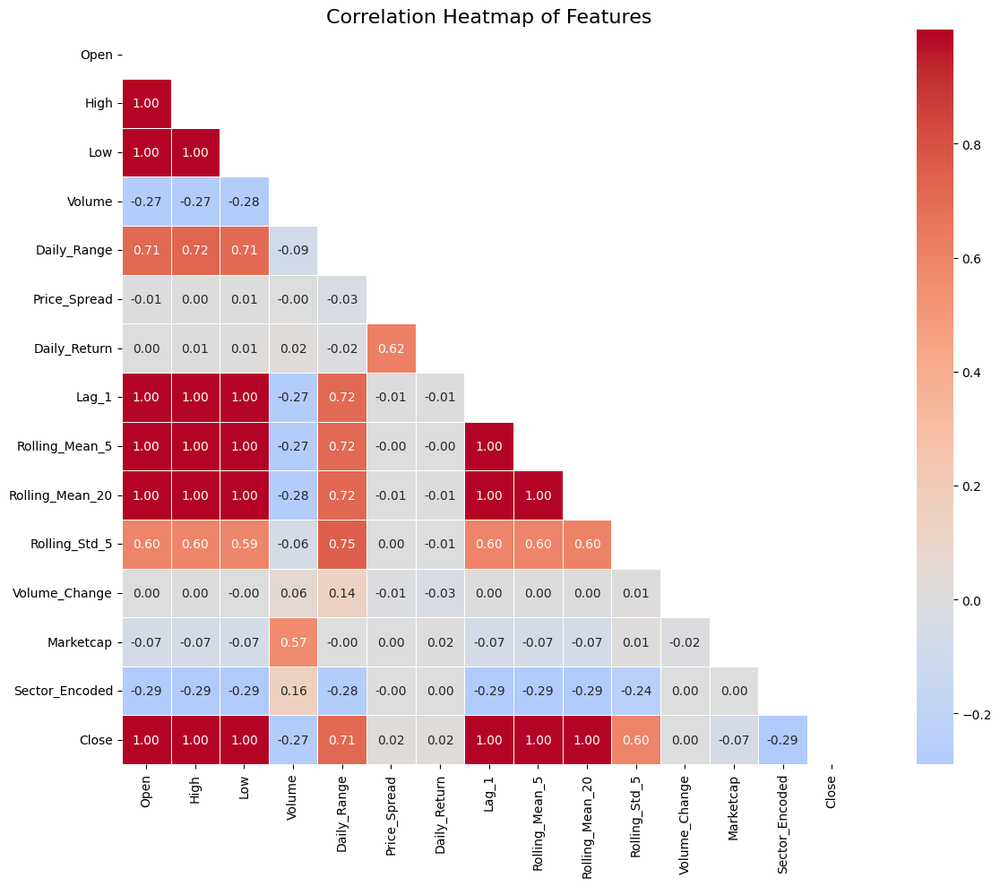
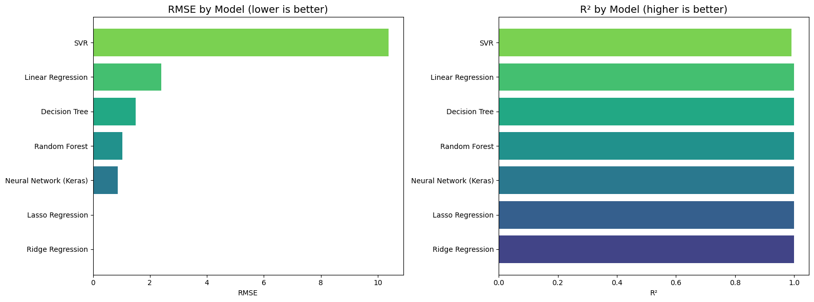
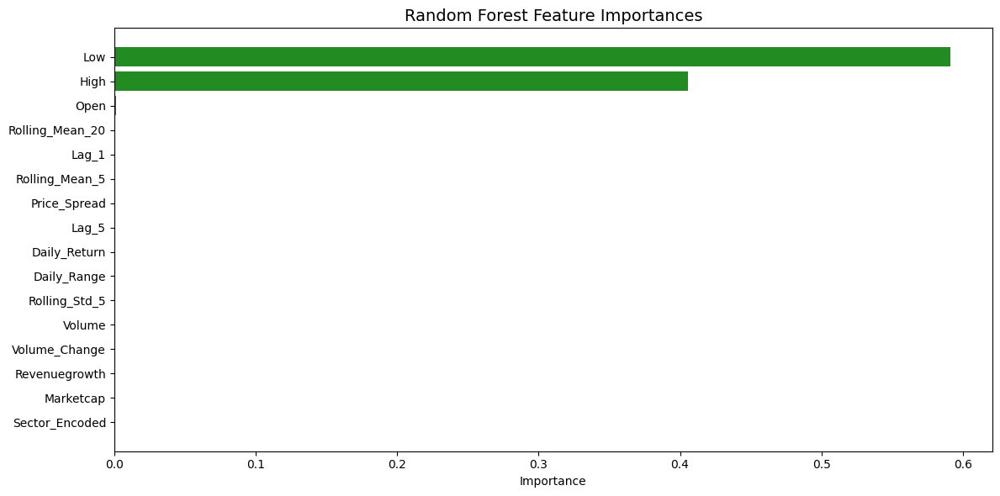

# Part 1 — Regression: Predicting S&P 500 Stock Closing Prices

## 1. Dataset Description

**Source**: [S&P 500 Stocks (daily updated) — Kaggle](https://www.kaggle.com/datasets/andrewmvd/sp-500-stocks/data)

This dataset contains daily stock market data for all companies in the S&P 500 index. We used two files:

- **sp500_stocks.csv** (1.89 M rows): Daily OHLCV data — Date, Symbol, Open, High, Low, Close, Adj Close, Volume.
- **sp500_companies.csv** (502 rows): Company fundamentals — Sector, Market Cap, EBITDA, Revenue Growth, Weight.

**Why this dataset?** The S&P 500 is the most widely followed equity benchmark globally. Predicting closing prices is a fundamental regression task with clear real-world significance, and the dataset provides rich features for engineering.

**Subset used**: Top 50 companies by market cap, from 2018 onward, producing ~60,000+ usable rows after cleaning.

**Target variable**: `Close` — the daily closing price (continuous numeric).

## 2. Methodology

### Preprocessing
- Merged daily stock data with company fundamentals on `Symbol`.
- Dropped rows with missing values (mainly early Volume NaN).
- Engineered 16 features: Daily Range, Price Spread, Daily Return, lagged prices (Lag_1, Lag_5), rolling averages (5-day, 20-day), rolling std, volume change, and sector encoding.

*Figure 1: Feature correlation heatmap shows strong linear relationships between Close and Open/High/Low, with additional information from rolling and lag features.*

### Model Choices

All 7 required models were trained:

| # | Model | Key Configuration |
|---|-------|-------------------|
| 1 | Linear Regression | Baseline (OLS) |
| 2 | Lasso (L1) | α=0.1, max_iter=10000 |
| 3 | Ridge (L2) | α=1.0 |
| 4 | SVR | Pipeline(StandardScaler → RBF kernel, C=100) |
| 5 | Decision Tree | max_depth=15 |
| 6 | Random Forest | n_estimators=100, max_depth=20 |
| 7 | Neural Network | 3 hidden layers (128→64→32), Dense(1) output, loss='mse' |

SVR and Neural Network were wrapped with **StandardScaler** as required.

### Hyperparameter Tuning

**Random Forest** was selected for tuning via **GridSearchCV** (3-fold CV) due to its high sensitivity to n_estimators, max_depth, and min_samples_split.

| Parameter | Search Values |
|-----------|---------------|
| n_estimators | 100, 200, 300 |
| max_depth | 10, 20, 30 |
| min_samples_split | 2, 5, 10 |

**Best parameters found**: n_estimators=300, max_depth=30, min_samples_split=2.

## 3. Results

### Model Comparison

| Model | RMSE | MAE | R² | Training Time (s) |
|-------|------|-----|----|-------------------|
| Ridge Regression | **0.0001** | **0.0000** | **1.0000** | 0.00 |
| Lasso Regression | 0.0297 | 0.0172 | 1.0000 | 0.00 |
| Neural Network (Keras) | 0.8693 | 0.6073 | 0.9999 | 4.19 |
| Random Forest (Tuned) | 1.0256 | 0.5203 | 0.9999 | 2689.28 |
| Random Forest (Default) | 1.0295 | 0.5218 | 0.9999 | 2.30 |
| Decision Tree | 1.4913 | 0.7512 | 0.9998 | 0.24 |
| Linear Regression | 2.4065 | 1.4050 | 0.9995 | 0.06 |
| SVR | 10.3737 | 0.6864 | 0.9914 | 85.19 |

All models achieved R² > 0.99, indicating strong predictive power due to the high correlation between Open/High/Low and Close.

*Figure 2: RMSE and R² comparison across all models. Ridge and Lasso dominate due to the near-perfect linear relationship between features and target.*

### Key Findings

- **Lasso** reduced features from 16 to 7 — only Open, High, Low, Volume, Price_Spread, Marketcap, and Lag_1 survived. This confirms that Close is almost entirely determined by same-day price features.
- **Random Forest** feature importance shows Low (59.1%) and High (40.6%) as dominant features.
- GridSearchCV improved RF RMSE by 0.37% (1.0295 → 1.0256), a modest gain confirming the default was already near-optimal.

*Figure 3: Random Forest ranks Low and High as the two most important features by far.*

## 4. Conclusion

**Recommended Model: Ridge Regression**

Ridge Regression achieved the lowest RMSE (0.0001) and perfect R² (1.0000). This is expected because the closing price has a near-linear relationship with the open, high, and low prices of the same day. Ridge's L2 regularization handles the multicollinearity among these correlated features effectively.

While Random Forest and Neural Network captured non-linear patterns, the additional complexity did not improve upon Ridge for this target. For tasks where same-day OHLC data is not available (e.g., forecasting future prices), tree-based models would likely outperform linear approaches.
