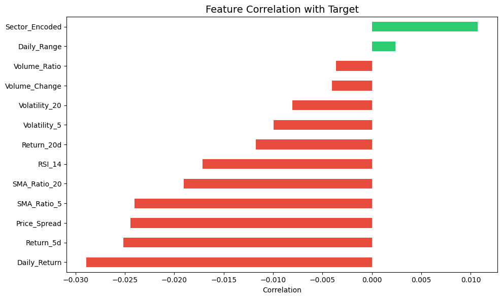
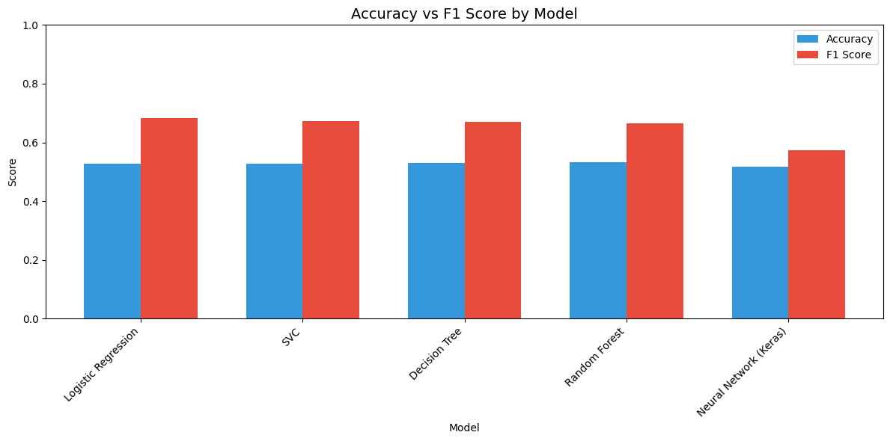
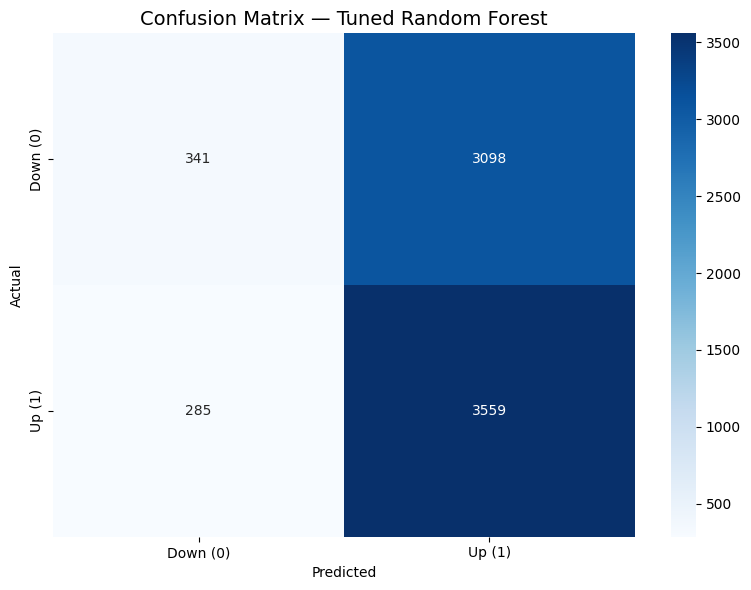

# Part 2 — Classification: Predicting S&P 500 Stock Price Direction

## 1. Dataset Description

**Source**: [S&P 500 Stocks (daily updated) — Kaggle](https://www.kaggle.com/datasets/andrewmvd/sp-500-stocks/data)

This dataset contains daily OHLCV stock data for all S&P 500 companies. We used the same subset as Part 1 (top 50 companies by market cap, 2018–present).

**Target variable**: Binary — **1** if next-day close > today's close (UP), **0** otherwise (DOWN). This transforms the regression problem into a binary classification of price direction.

**Class balance**: Approximately 52% UP days, 48% DOWN days — near-balanced but F1 is still used as the primary metric since accuracy alone can be misleading for directional prediction.

**Why this dataset?** Predicting stock price direction is a canonical classification challenge in quantitative finance. The near-random nature of daily returns makes this a rigorous test of classification models.

## 2. Methodology

### Feature Engineering

We engineered 13 technical indicator features from raw OHLCV data:

| Feature Category | Features |
|-----------------|----------|
| Price-based | Daily Return, Daily Range (normalized), Price Spread |
| Momentum | 5-day return, 20-day return, SMA ratio (5, 20) |
| Volume | Volume change, Volume ratio to 5-day MA |
| Volatility | 5-day & 20-day rolling std of returns |
| Technical | RSI (14-day) |
| Categorical | Sector (encoded) |

*Figure 1: Feature correlation with target. Most features have weak correlation with direction, reflecting the inherent randomness of daily price movements.*

### Model Choices

| # | Model | Key Configuration |
|---|-------|-------------------|
| 1 | Logistic Regression | max_iter=1000 |
| 2 | SVC | **Pipeline(StandardScaler → RBF, C=1.0)** |
| 3 | Decision Tree | max_depth=10 |
| 4 | Random Forest | n_estimators=200, max_depth=15 |
| 5 | Neural Network | **StandardScaler** + 3 layers (64→32→16), **sigmoid**, **binary_crossentropy** |

SVC and Neural Network were wrapped with **StandardScaler** as mandated.

### Hyperparameter Tuning

**Random Forest Classifier** was tuned via **GridSearchCV** (3-fold CV, scoring='f1'):

| Parameter | Search Values | Best |
|-----------|---------------|------|
| n_estimators | 100, 200, 300 | **300** |
| max_depth | 10, 15, 20, None | **10** |
| min_samples_split | 2, 5, 10 | **10** |

## 3. Results

### Model Comparison (sorted by F1 Score)

| Model | Accuracy | F1 Score | Precision | Recall |
|-------|----------|----------|-----------|--------|
| Logistic Regression | 0.5277 | **0.6829** | 0.5288 | 0.9636 |
| Random Forest (Tuned) | 0.5355 | 0.6778 | 0.5346 | 0.9259 |
| SVC | 0.5284 | 0.6730 | 0.5307 | 0.9196 |
| Decision Tree | 0.5293 | 0.6689 | 0.5320 | 0.9009 |
| Random Forest (Default) | 0.5319 | 0.6638 | 0.5346 | 0.8754 |
| Neural Network (Keras) | 0.5181 | 0.5730 | 0.5382 | 0.6126 |

*Figure 2: Accuracy vs F1 Score across all models. All models achieve similar accuracy (~53%), but F1 scores differ due to varying precision-recall trade-offs.*

### Key Findings

- **All models achieve accuracies near 53%**, only slightly above random (50%), which is expected — daily stock movements are notoriously difficult to predict.
- **Logistic Regression** achieved the best F1 (0.6829) due to very high recall (0.9636), though with lower precision 0.5288).
- **Tuning improved RF** from F1=0.6638 to F1=0.6778 by regularizing with lower max_depth (10) and higher min_samples_split (10).
- The **Decision Tree** visualization (max_depth=3) reveals that Daily_Return and RSI are the primary split features.

*Figure 3: Confusion matrix for the tuned Random Forest — shows slight bias toward predicting UP.*

## 4. Conclusion

**Recommended Model: Logistic Regression**

Despite its simplicity, Logistic Regression achieved the highest F1 score (0.6829). Its high recall (0.9636) means it catches almost all UP days, though at the cost of many false positives. In practice, this suggests the model learns that the long-term market bias is upward.

The modest accuracy across all models confirms that daily stock direction is essentially a random walk with a slight upward drift — a well-established result in financial literature. More sophisticated models (RF, NN) did not significantly outperform the logistic baseline, suggesting that the features capture limited predictive signal at the daily frequency.
