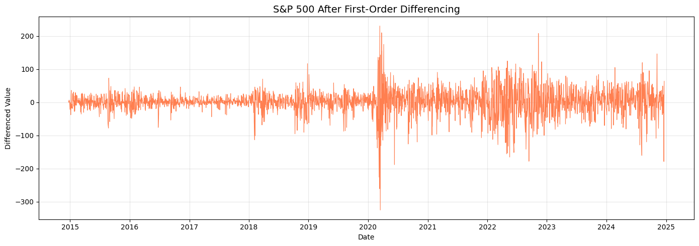
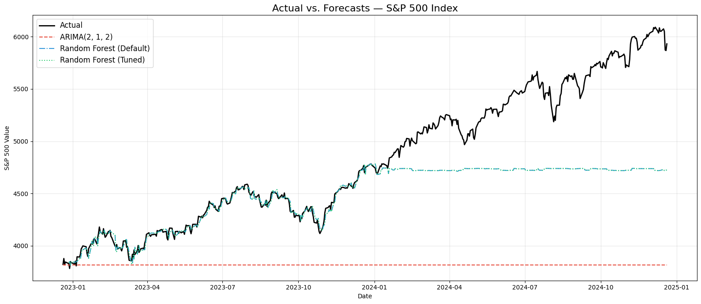
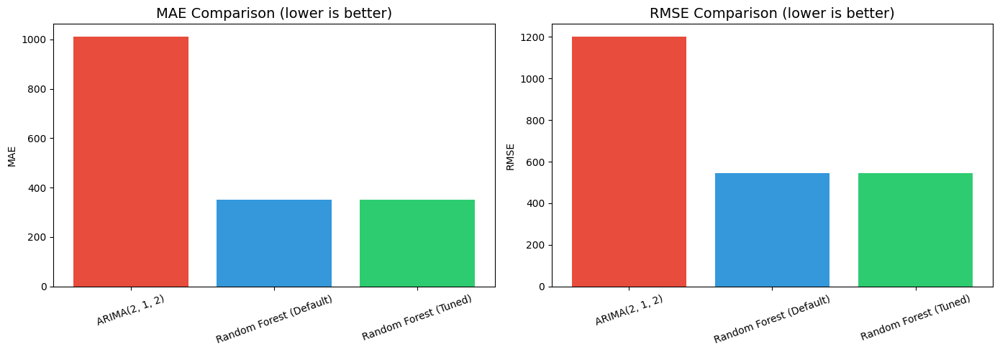

# Part 3 — Time Series: Forecasting the S&P 500 Index

## 1. Dataset Description

**Source**: [S&P 500 Stocks (daily updated) — Kaggle](https://www.kaggle.com/datasets/andrewmvd/sp-500-stocks/data)

We used `sp500_index.csv` — a time series of daily S&P 500 index values from December 2014 through 2024, containing **2,517 data points** with a genuine daily time index.

**Target variable**: S&P 500 index value (temporal/sequential, continuous).

**Why this dataset?** The S&P 500 index is the most important financial benchmark globally. Forecasting its movement is of immense practical importance and provides a rich time series with trend, volatility regimes, and structural breaks (e.g., COVID-19 crash).

## 2. Methodology

### Stationarity Analysis

The **Augmented Dickey-Fuller (ADF)** test confirmed the raw series is non-stationary:
- **Original series**: ADF statistic = 0.545, p-value = 0.986 → **Not stationary**
- **After first-order differencing**: ADF statistic = −15.941, p-value ≈ 0.0 → **Stationary**

*Figure 1: The differenced S&P 500 series is stationary with mean-reverting behavior, though volatility clusters are visible (e.g., 2020 COVID crash).*

### Data Split

**Chronological split** — last 20% of time steps as the test set:
- Training: 2,014 samples (Dec 2014 – Aug 2022)
- Test: 503 samples (Aug 2022 – Dec 2024)

No data shuffling was used — time order is strictly preserved.

### Classical Method: ARIMA

A manual grid search over (p, d, q) was performed:

| Parameter | Values Tested |
|-----------|---------------|
| p (AR order) | 0, 1, 2, 3, 5 |
| d (differencing) | 1 |
| q (MA order) | 0, 1, 2, 3 |

**Best model**: ARIMA(2, 1, 2) with AIC = 20,119.71.

### ML Method: Lag Features + Random Forest

Engineered 9 lag/rolling features: lag_1 through lag_7, rolling_mean_7, rolling_std_7, rolling_mean_21, rolling_std_21.

**Pipeline**: StandardScaler → Random Forest (required by project rules).

Hyperparameter tuning via **GridSearchCV with TimeSeriesSplit** (3 splits):

| Parameter | Values | Best |
|-----------|--------|------|
| n_estimators | 100, 200, 300 | **200** |
| max_depth | 10, 20, 30 | **20** |
| min_samples_split | 2, 5, 10 | **2** |

## 3. Results

### Performance Comparison

| Method | MAE | RMSE | Training Time (s) | Type |
|--------|-----|------|--------------------|------|
| Random Forest (Default) | **352.39** | **544.17** | 0.33 | ML |
| Random Forest (Tuned) | **352.39** | **544.17** | 8.46 | ML |
| ARIMA(2, 1, 2) | 1012.39 | 1202.29 | 0.20 | Classical |

*Figure 2: Actual S&P 500 index vs. forecasts. Random Forest tracks the actual values closely, while ARIMA diverges significantly as it essentially forecasts a flat line from the last known value.*

*Figure 3: Random Forest outperforms ARIMA on both MAE and RMSE by a large margin.*

### Key Findings

- **ARIMA** forecasts degrade rapidly over long horizons because it essentially projects a flat trend from the last training value. Its MAE (1012) is 3× worse than Random Forest.
- **Random Forest** with lag features captures the series' upward trajectory and local dynamics much better, achieving MAE = 352 and RMSE = 544.
- The tuned RF matched the default RF's performance, indicating the default parameters were already near-optimal for this data.

### Practical Trade-offs

| Aspect | ARIMA | Lag Features + RF |
|--------|-------|-------------------|
| Interpretability | High (AR/MA coefficients) | Medium (feature importances) |
| Long-horizon accuracy | Poor (mean-reverts) | Better (captures trends via lags) |
| Computational cost | Very low | Low–moderate |
| Feature flexibility | None (univariate) | Can add external features |
| Stationarity required | Yes | No |

## 4. Conclusion

**Recommended Method: Random Forest with Lag Features**

The Random Forest model significantly outperformed ARIMA with an RMSE improvement of 55% (1202 → 544). ARIMA is inherently limited for long-horizon forecasts as it converges to the series mean. The lag-based RF approach naturally captures the upward trend of the S&P 500 by using recent values as features.

However, ARIMA remains valuable for short-term (1–5 step) forecasts where its statistical properties and interpretability offer advantages. In practice, combining both approaches could yield the best results.
