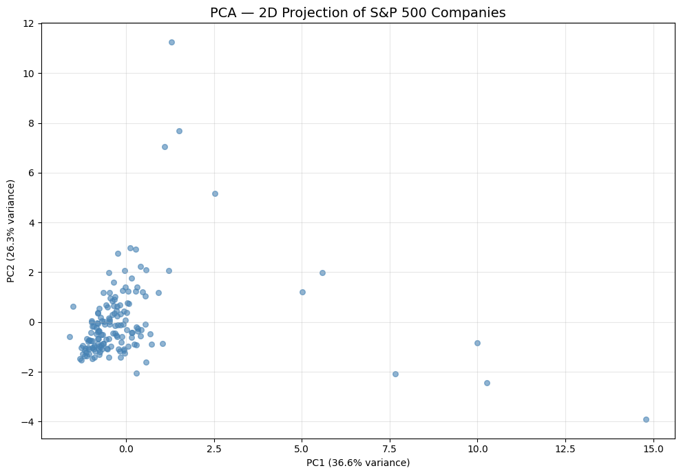
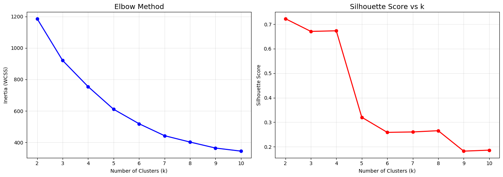
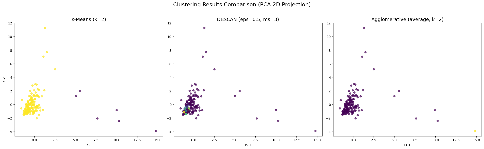

# Part 4 — Clustering: Grouping S&P 500 Companies

## 1. Dataset Description

**Source**: [S&P 500 Stocks (daily updated) — Kaggle](https://www.kaggle.com/datasets/andrewmvd/sp-500-stocks/data)

We combined two files for this unsupervised analysis:

- **sp500_stocks.csv**: Aggregated per-company stock metrics — average daily return, volatility, average volume, average close, average daily range.
- **sp500_companies.csv**: Company fundamentals — Current Price, Market Cap, EBITDA, Revenue Growth, Full-time Employees, Index Weight.

**Total features**: 11 numeric features, **no target variable** (fully unsupervised).

**Why this dataset?** Grouping S&P 500 companies by financial behavior reveals natural market segments — mega-cap tech vs. traditional industrials vs. high-growth firms — useful for portfolio diversification and sector analysis.

## 2. Methodology

### Preprocessing
- Aggregated daily stock data per company (mean return, std of returns as volatility, mean volume, mean close).
- Merged with company fundamentals (Market Cap, EBITDA, Revenue Growth, Employees, Weight).
- Dropped rows with missing values.
- **StandardScaler** applied to all features before every clustering algorithm.
- **PCA** reduced to 2 components for visualization only; clustering was performed on the full 11-feature scaled set.

*Figure 1: PCA 2D projection of S&P 500 companies. A few outlier companies (mega-cap tech) are clearly separated from the main cluster.*

### Algorithms and Tuning

**K-Means**: Tested k = 2 to 10 using the Elbow Method (inertia/WCSS) and Silhouette Scores.

**DBSCAN**: Systematically varied eps (0.5–5.0) and min_samples (3, 5, 7, 10). Selected the configuration with the highest Silhouette Score among those producing ≥2 clusters.

**Agglomerative Clustering**: Compared three linkage methods (ward, complete, average) across k = 2 to 5, selecting the combination with the highest Silhouette Score. Dendrograms plotted for ward and complete linkage.

## 3. Results

### Clustering Comparison

| Algorithm | # Clusters | Silhouette Score | Key Observations |
|-----------|-----------|-----------------|------------------|
| **K-Means** | 2 | 0.7226 | Clean separation; Elbow + Silhouette confirm k=2 |
| **DBSCAN** | 6 | 0.3622 | 131 noise points; density-based, identifies outliers |
| **Agglomerative** | 2 | **0.8072** | Average linkage best; hierarchical structure visible |

*Figure 2: K-Means Elbow plot (left) and Silhouette analysis (right). Both indicate k=2 as optimal.*

*Figure 3: Side-by-side comparison of all three clustering results on PCA 2D projection. K-Means and Agglomerative produce similar 2-cluster solutions; DBSCAN identifies 6 clusters with many noise points.*

### Linkage Method Comparison (Agglomerative)

| n_clusters | Average | Complete | Ward |
|-----------|---------|----------|------|
| 2 | **0.807** | 0.762 | 0.762 |
| 3 | 0.761 | 0.738 | 0.686 |
| 4 | 0.683 | 0.688 | 0.688 |
| 5 | 0.684 | 0.687 | 0.248 |

Average linkage with k=2 produced the highest Silhouette Score (0.807).

### Key Findings

- The data naturally splits into **2 main clusters**: mega-cap companies (Apple, Microsoft, Amazon, etc.) vs. the remaining S&P 500 members, primarily driven by Market Cap, EBITDA, and Weight.
- **DBSCAN** identified 131 noise points (26% of companies) — these are companies with unusual combinations of features that don't fit neatly into dense clusters.
- The **dendrogram** reveals a hierarchical structure: the first major split separates mega-caps, followed by finer divisions by sector and growth characteristics.

## 4. Conclusion

**Recommended Algorithm: Agglomerative Clustering (Average Linkage)**

Agglomerative Clustering achieved the highest Silhouette Score (0.8072), producing the cleanest and most interpretable 2-cluster solution. The hierarchical nature also provides the dendrogram, offering insight into sub-group structures within each cluster.

K-Means is a close second (Silhouette = 0.7226) and is more practical for larger datasets due to its computational efficiency. DBSCAN, while useful for identifying outlier companies, produced a lower Silhouette Score due to the non-uniform density of financial data.

For portfolio construction, the 2-cluster solution (mega-cap vs. rest) provides a fundamental diversification axis. Finer-grained clustering (k=3–5) could separate growth vs. value vs. defensive stocks for more nuanced allocation strategies.
